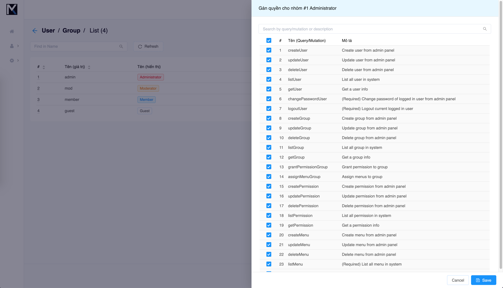

# CMS starter kit (Boilerplate) sử dụng Flask và Vue

Source code sử dụng Flask framwork cho Backend server và Vue framework để build UI. Giao thức giao tiếp giữa client và server chủ yếu sử dụng GraphQL.

## Features

- Xác thực và phân quyền trên cả Backend và Frontend sử dụng JWT token và ACL
- Đa ngôn ngữ trên cả Backend và Frontend
- Google login API
- Realtime cập nhật Navigation menu cho từng nhóm thành viên
- Realtime cập nhật Quyền cho từng nhóm thành viên
- Socketio ready
- Redis ready
- GraphQL ready
- RESTful ready
- Frontend multi layout
- Phân quyền Frontend sử dụng CASL
